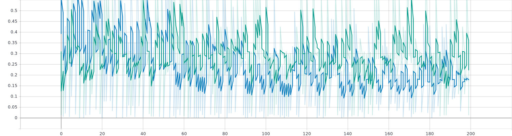
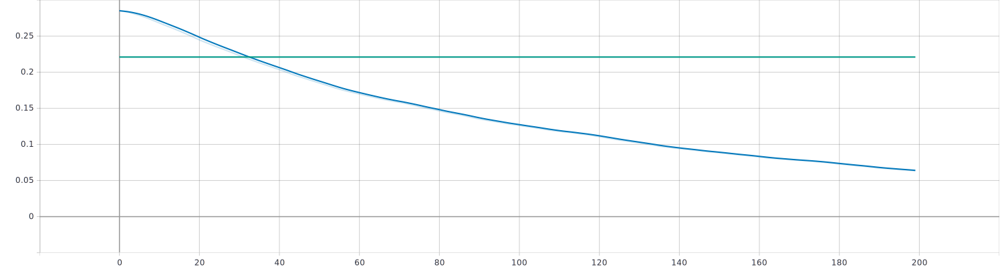

# qless-tablut-solver

The *Q-Less* Tablut solver is the implementation of an idea I had during the RL classes. It aims to solve a very niche
problem and, for all I know, it may work, but I have neither the resources nor the time to test this idea fully.

Which is why I spend about a week writing this code, obviously.

## What *Q-Less* is
We all know and love the *Q* function: it's that great thing that tells us what our (final) reward will be given the
current state and applying a certain action. To summarize:


Looks complicated, but it really isn't.

So this *Q* value function is used to build the *Q-table* where all the (known) values of states and actions are and then
we apply a search algorithm to choose which action to make in a given state.

It all sounds great till you realise how *boring* using a search algorithm (usually it's MCTS) is; wouldn't it be better
**know** already which is the best action in a given state? That's what *Q-less* is: given a state, predict what's the
best action **in one pass, without searching**.

And yes, this is basically to reduce the thinking time of any board-game agent to its minimum.

## How it *should* work
Sounds great, but what's the catch? The amount of data required, obviously.

Here's the outline for the training algorithm:

```
Given N agents and the environment
for i in I:
    S <- simulate M games, where M = 2x, with x the number of games won by each agent
    for j in J:
        train each agent on a subset of S, considering only the last y moves, with y increasing at each j
```

The dataset contains the state representation as a `9x9x3` image and the labels are the action performed (the action here
is the index of the move normalized to all valid moves in a given state); the state-actions tuple are extracted only from
games that the agent has *won* (which is the biggest reason building a significative dataset from random proved to be
expensive).

## Why it *should* work
Even though it starts from random games, the agents should be able to converge to a solution and explore enough (thanks
to some epsilon-decaying randomness in the action selection) that they could predict a good move for unknown states.

Ideally, given infinite games (or all possible state-action tuple), the agents will never make a bad move (or one that
results in a loss, anyways).  

## How to make it work
If you want to test this crazy idea for yourself, you first need to download the Tablut environment from
[here](https://github.com/gallorob/gym-tablut) and follow the instructions there to install it.

Then, to get this project to work, you need to run the following commands:
```
git clone https://github.com/gallorob/qless-tablut-solver.git
```
```
cd qless-tablut-solver
```
```
pip install -r requirements.txt
```

## Final remarks
Expect the loss and accuracy for both train and test (train especially) to be rather noisy:





PRs are welcome but I honestly don't think I'll work on this much more.